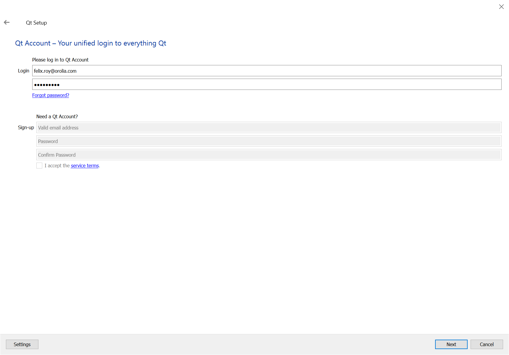
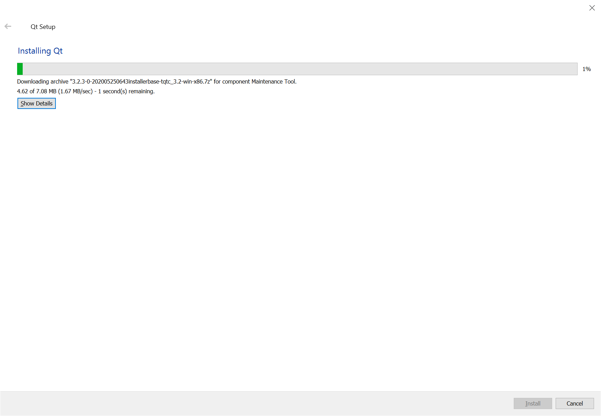

# Windows 10

## Prerequisites

### Microsoft Visual Studio 2017 Community for Windows Desktop

Download latest online installer: [https://visualstudio.microsoft.com/vs/older-downloads/](https://visualstudio.microsoft.com/vs/older-downloads/)

Open the installer

In _Workloads_ select _Desktop development with C++_

### Qt Open Source 5.12.3

#### Installation

Download the latest online installer: [https://www.qt.io/download-open-source](https://www.qt.io/download-open-source)

Launch the installer:

Select _MSVC 2017 64-bit_ under _Qt 5.12.3_ and make sure no option is selected in _Developer and Designer Tools_:

Wait to the installation to end, it may take a while:

### Git

Download the latest installer : [https://gitforwindows.org/](https://gitforwindows.org/)

## Compilation

